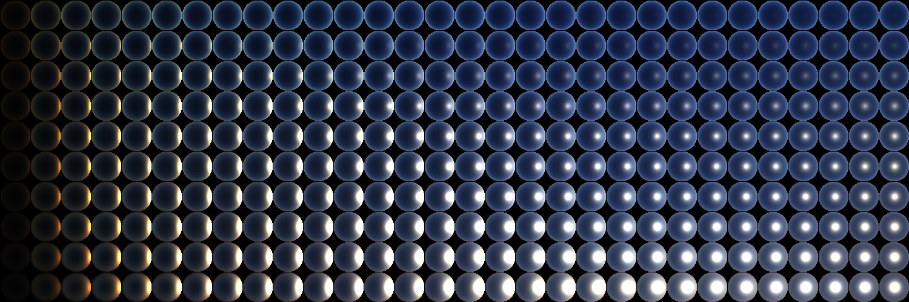

example usage of [ArHosek12](https://cgg.mff.cuni.cz/projects/SkylightModelling/) and [ArPrague21](https://cgg.mff.cuni.cz/publications/skymodel-2021/)

effect:

A chart with full-colour renditions of the proposed model for a ground albedo of zero, for turbidities 1 (topmost row) to 10 (bottom row).

# reference

## ArHosek12

* An Analytic Model for Full Spectral Sky-Dome Radiance https://cgg.mff.cuni.cz/projects/SkylightModelling/
  
  * https://gitlab.com/art-development-team/ART/-/blob/master/Source/Foundation/Physics/ArHosekSkyModel_ART_frontend.c

* pbrt imgtool/makesky https://github.com/mmp/pbrt-v4/blob/master/src/pbrt/cmd/imgtool.cpp

* githole/Skydome: An Analytic Model for Full Spectral Sky-Dome Radiance https://github.com/githole/Skydome

## ArPrague21

* A Fitted Radiance and Attenuation Model for Realistic Atmospheres https://cgg.mff.cuni.cz/publications/skymodel-2021/

  * https://gitlab.com/art-development-team/ART/-/blob/master/Source/Foundation/Physics/ArPragueSkyModel_ART_frontend.c

* PetrVevoda/pragueskymodel: Prague Sky Model https://github.com/PetrVevoda/pragueskymodel

## other

* Simple Analytic Approximationsto the CIE XYZ Color Matching Functions (JCGT) https://jcgt.org/published/0002/02/01/

  * Pete Shirley's Graphics Blog: Converting Spectra to XYZ/RGB values https://psgraphics.blogspot.com/2014/11/converting-spectra-to-xyzrgb-values.html